# 🌱 Controlled Climate Agriculture - IoT Polyhouse Outside Sensor Node

A comprehensive IoT-based environmental monitoring system for controlled climate agriculture using ESP32/ESP8266 microcontrollers, multiple sensors, and cloud-based data analytics. This system enables real-time monitoring and automated control of polyhouse environments for optimal plant growth.

[](https://www.arduino.cc/)
[](https://www.espressif.com/)
[](https://thingspeak.com/)

---

## 📑 Table of Contents

- [Overview](#overview)
- [Features](#features)
- [System Architecture](#system-architecture)
- [Hardware Components](#hardware-components)
- [Software Stack](#software-stack)
- [Installation](#installation)
  - [Hardware Setup](#hardware-setup)
  - [Software Setup](#software-setup)
- [Communication Protocol](#communication-protocol)
- [Data Visualization](#data-visualization)
- [Applications](#applications)

---

## 🎯 Overview

The **Controlled Climate Agriculture (CCA) Outside Sensor Node** is designed to monitor environmental parameters outside polyhouses and greenhouses, providing critical data for maintaining optimal growing conditions inside. This project specifically addresses the challenges of classical agriculture by implementing precision farming techniques with real-time data acquisition and automated environmental control.

### Key Objectives

- ✅ Monitor real-time environmental parameters outside polyhouses
- ✅ Provide comparative data for indoor climate control
- ✅ Enable automated irrigation and climate management
- ✅ Reduce resource consumption (water, energy, nutrients)
- ✅ Improve crop yields through precision agriculture
- ✅ Support sustainable farming practices

---

## ✨ Features

### Environmental Monitoring
- 🌡️ **Temperature & Humidity Tracking** using SHT20 sensor
- 💨 **CO2 Level Monitoring** with MH-Z19C sensor
- ☀️ **Ambient Light Intensity** measurement via TSL2591
- 💧 **Water Temperature Monitoring** with DS18B20 sensors
- 🌊 **Water Flow Measurement** using YF-S201 sensors

### Technical Features
- 📡 **ESP-NOW Protocol** for low-power, direct device communication
- ☁️ **Cloud Integration** with ThingSpeak for data visualization
- 🔄 **Real-time Data Synchronization** between sensor nodes
- 🔋 **Power-efficient Design** with solar charging capability
- 🎛️ **I2C Multiplexing** for multiple sensor integration
- 🔐 **Reliable Wireless Communication** without router dependency

### System Capabilities
- 📊 **Real-time Data Analytics** and graphical representation
- 🚨 **Automated Alerts** for abnormal conditions
- 💡 **LED Indicators** for power and data transmission status
- 🌐 **Scalable Architecture** for multiple sensor deployment
- 📈 **Historical Data Logging** for trend analysis

---

## 🏗️ System Architecture

```mermaid
graph TD
    subgraph "SENSOR LAYER"
        A1["🌡️ SHT20<br/>Temperature & Humidity"]
        A2["💨 MH-Z19C<br/>CO2 Sensor"]
        A3["☀️ TSL2591<br/>Light Sensor"]
        A4["🌊 DS18B20-1<br/>Water Temp 1"]
        A5["🌊 DS18B20-2<br/>Water Temp 2"]
        A6["💧 YF-S201-1<br/>Flow Sensor 1"]
        A7["💧 YF-S201-2<br/>Flow Sensor 2"]
    end

    subgraph "SIGNAL ROUTING"
        B["🔀 PCA9548A<br/>I2C Multiplexer<br/>8-Channel"]
    end

    subgraph "PROCESSING"
        C["🖥️ NodeMCU ESP8266<br/>Data Processing<br/>JSON Formatting<br/>Wi-Fi Connection"]
    end

    subgraph "CLOUD PLATFORM"
        F["☁️ ThingSpeak Server<br/>Real-time Storage<br/>Data Visualization<br/>HTTP API"]
    end

    subgraph "CONTROL SYSTEM"
        G["⚙️ Automated Control<br/>Decision Making<br/>Data Analysis"]
        H1["💧 Foggers"]
        H2["🌀 Fans"]
        H3["💡 Lights"]
        H4["💧 Irrigation"]
    end

    A1 --> B
    A2 --> B
    A3 --> B
    A4 --> C
    A5 --> C
    A6 --> C
    A7 --> C
    B --> C
    C -->|HTTP POST via Wi-Fi| F
    F -->|Data Analysis & Alerts| G
    G --> H1
    G --> H2
    G --> H3
    G --> H4

    style A1 fill:#11998e,stroke:#0d7a6f,stroke-width:2px,color:#fff
    style A2 fill:#11998e,stroke:#0d7a6f,stroke-width:2px,color:#fff
    style A3 fill:#11998e,stroke:#0d7a6f,stroke-width:2px,color:#fff
    style A4 fill:#11998e,stroke:#0d7a6f,stroke-width:2px,color:#fff
    style A5 fill:#11998e,stroke:#0d7a6f,stroke-width:2px,color:#fff
    style A6 fill:#11998e,stroke:#0d7a6f,stroke-width:2px,color:#fff
    style A7 fill:#11998e,stroke:#0d7a6f,stroke-width:2px,color:#fff
    style B fill:#4facfe,stroke:#2b8fd9,stroke-width:2px,color:#fff
    style C fill:#f093fb,stroke:#d66de8,stroke-width:2px,color:#fff
    style F fill:#fa709a,stroke:#f54278,stroke-width:2px,color:#fff
    style G fill:#30cfd0,stroke:#22a5a6,stroke-width:2px,color:#fff
    style H1 fill:#330867,stroke:#220544,stroke-width:2px,color:#fff
    style H2 fill:#330867,stroke:#220544,stroke-width:2px,color:#fff
    style H3 fill:#330867,stroke:#220544,stroke-width:2px,color:#fff
    style H4 fill:#330867,stroke:#220544,stroke-width:2px,color:#fff
```


### Data Flow
1. **Sensors** continuously capture environmental parameters (temperature, humidity, CO2, light, water temperature, flow rate)
2. **I2C Multiplexer (PCA9548A)** routes I2C sensor data to ESP8266
3. **NodeMCU ESP8266** processes and formats sensor data into JSON
4. **Wi-Fi Connection** transmits data to cloud via HTTP POST
5. **ThingSpeak Server** stores and visualizes data in real-time
6. **Control System** analyzes data and triggers automated adjustments to foggers, fans, lights, and irrigation

---
### Data Flow
1. **Multiple Sensors** continuously capture environmental parameters
2. **ESP8266/ESP32 Microcontroller** processes and aggregates sensor data
3. **I2C Multiplexer (PCA9548A)** manages multiple I2C sensors
4. **ESP-NOW Protocol** transmits data to gateway/server node
5. **Gateway Node** receives data from multiple sensor nodes
6. **ThingSpeak Cloud** stores and visualizes data in real-time
7. **Control Systems** analyze data and trigger automated adjustments

---

## 🔧 Hardware Components

| Component | Model | Purpose | Specifications |
|-----------|-------|---------|----------------|
| **Microcontroller** | NodeMCU ESP8266 | Data processing & communication | 80/160MHz, 80KB RAM, Wi-Fi |
| **Temperature Sensor (Water)** | DS18B20 (×2) | Water temperature monitoring | -55°C to +125°C, ±0.5°C accuracy |
| **Temp & Humidity Sensor** | SHT20 | Air temperature & humidity | ±0.3°C, ±3%RH accuracy |
| **CO2 Sensor** | MH-Z19C | Carbon dioxide measurement | 400-10000ppm, ±50ppm accuracy |
| **Light Sensor** | TSL2591 | Ambient light intensity | 0.1-40,000 lux, 600M:1 dynamic range |
| **Water Flow Sensor** | YF-S201 (×2) | Flow rate measurement | 1-30 L/min, 450 pulses/liter |
| **I2C Multiplexer** | PCA9548A | Multiple I2C device management | 8-channel bidirectional switch |
| **LEDs** | Standard (×2) | Status indication | Power & data logging indicators |

### Detailed Component Specifications

#### DS18B20 - Water Temperature Sensor
- **Interface**: 1-Wire digital protocol
- **Voltage**: 3V to 5.5V DC
- **Temperature Range**: -55°C to +125°C
- **Accuracy**: ±0.5°C
- **Wire Colors**: Red (Vcc), Black (GND), Yellow (Data)
- **Note**: Requires 4.7kΩ pull-up resistor

#### SHT20 - Temperature & Humidity Sensor
- **Interface**: I2C (RS485 protocol)
- **Voltage**: 2.1V to 3.6V (recommended 3.0V)
- **Power**: Maximum 0.2W
- **Operating Conditions**: -20°C to +60°C, 0-100%RH
- **Accuracy**: ±0.3°C (temperature), ±3%RH (humidity) at 25°C
- **Wire Colors**: Red (Vcc), Black (GND), Yellow (SDA), Green (SCL)

#### MH-Z19C - CO2 Sensor
- **Interface**: UART (with PWM output option)
- **Voltage**: 5.0±0.1V DC
- **Detection Range**: 400-10,000ppm
- **Accuracy**: ±50ppm + 5% reading value
- **Technology**: Non-Dispersive Infrared (NDIR)
- **Features**: Built-in temperature compensation

#### TSL2591 - Ambient Light Sensor
- **Interface**: I2C
- **Voltage**: 3V to 5V DC (3.3V regulated onboard)
- **Range**: 0.1 to 40,000 lux
- **Dynamic Range**: 600,000,000:1
- **Pins**: Vin (3-5V), 3V0 (3.3V out), GND, SCL, SDA, ADDR

#### YF-S201 - Water Flow Sensor
- **Interface**: Digital GPIO (Hall effect sensor)
- **Voltage**: 3V to 18V DC
- **Flow Rate**: 1 to 30 L/min
- **Output**: 450 pulses per liter
- **Resolution**: ~2.25mL per pulse
- **Wire Colors**: Red (Vcc), Black (GND), Yellow (Data)

#### PCA9548A - I2C Multiplexer
- **Purpose**: Enables connection of multiple I2C devices with same address
- **Channels**: 8 bidirectional channels (SC0/SD0 to SC7/SD7)
- **Function**: Routes master SCL/SDA to selected slave channels
- **Usage**: Essential when using multiple SHT20 or TSL2591 sensors

---

## 💻 Software Stack

### Development Environment
- **IDE**: Arduino IDE 2.0 or higher
- **Programming Language**: Arduino C/C++
- **Communication Protocol**: ESP-NOW
- **Cloud Platform**: ThingSpeak

### Key Arduino Libraries
```cpp
// Sensor Libraries
#include <Wire.h>              // I2C communication
#include <OneWire.h>           // Dallas temperature sensor
#include <DallasTemperature.h> // DS18B20 interface
#include <Adafruit_TSL2591.h>  // Light sensor
#include <MHZ19.h>             // CO2 sensor

// Communication
#include <ESP8266WiFi.h>       // Wi-Fi functionality
#include <espnow.h>            // ESP-NOW protocol

// I2C Multiplexer
#include <TCA9548A.h>          // I2C MUX control
```

### Required Libraries Installation
- Wire (Built-in)
- OneWire
- DallasTemperature
- Adafruit_TSL2591
- MHZ19
- ESP8266WiFi (Built-in)
- TCA9548A

---

## 📥 Installation

### Hardware Setup

#### Required Components
- NodeMCU ESP8266 × 1
- DS18B20 Water Temperature Sensor × 2
- SHT20 Temperature & Humidity Sensor × 1
- MH-Z19C CO2 Sensor × 1
- TSL2591 Light Sensor × 1
- YF-S201 Water Flow Sensor × 2
- PCA9548A I2C Multiplexer × 1
- LEDs × 2 (Power & Data indicators)
- 4.7kΩ Resistors (for DS18B20)
- PCB/Perfboard
- Weather-resistant enclosure
- Connecting wires (4-wire cables, 3.5m length per sensor)

#### Pin Connections

**DS18B20 Water Temperature Sensors:**
```
ESP8266 Pin    →    DS18B20
GPIO (D4)      →    Data (Yellow) - via 4.7kΩ pullup
3.3V           →    Vcc (Red)
GND            →    GND (Black)
```

**SHT20 Temperature & Humidity (via I2C MUX):**
```
I2C MUX Channel 0    →    SHT20
SC0                  →    SCL (Green)
SD0                  →    SDA (Yellow)
3.3V                 →    Vcc (Red)
GND                  →    GND (Black)
```

**MH-Z19C CO2 Sensor:**
```
ESP8266 Pin    →    MH-Z19C
GPIO (D5)      →    TX
GPIO (D6)      →    RX
5V             →    Vin
GND            →    GND
```

**TSL2591 Light Sensor (via I2C MUX):**
```
I2C MUX Channel 1    →    TSL2591
SC1                  →    SCL
SD1                  →    SDA
3.3V                 →    Vin
GND                  →    GND
```

**YF-S201 Flow Sensors:**
```
ESP8266 Pin    →    YF-S201 (1)    →    YF-S201 (2)
GPIO (D7)      →    Data (Yellow)  →    -
GPIO (D8)      →    -              →    Data (Yellow)
5V             →    Vcc (Red)      →    Vcc (Red)
GND            →    GND (Black)    →    GND (Black)
```

**PCA9548A I2C Multiplexer:**
```
ESP8266 Pin    →    PCA9548A
D1 (GPIO5)     →    SCL
D2 (GPIO4)     →    SDA
3.3V           →    Vcc
GND            →    GND
```

**Status LEDs:**
```
ESP8266 Pin    →    LED
GPIO (D3)      →    Power LED (via 220Ω resistor)
GPIO (D0)      →    Data Logging LED (via 220Ω resistor)
```

#### Assembly Steps

1. **PCB Preparation**
   - Solder NodeMCU ESP8266 onto perfboard/PCB
   - Mount PCA9548A I2C multiplexer
   - Solder connecting pins and ports
   - Add 4.7kΩ pull-up resistor for DS18B20 data line

2. **Sensor Connections**
   - Prepare 4-wire cables (3.5m length) for each sensor
   - Connect sensors according to pin diagram above
   - Ensure proper wire color coding for maintenance

3. **Indicator LEDs**
   - Connect power LED to GPIO D3 via 220Ω resistor
   - Connect data logging LED to GPIO D0 via 220Ω resistor

4. **Enclosure Assembly**
   - Drill holes in weather-resistant casing for sensor cables
   - Mount PCB inside enclosure
   - Pass sensor cables through holes
   - Seal cable entry points for weather protection

5. **Power Supply**
   - Connect 5V power supply or solar panel with battery
   - Ensure voltage regulation for 3.3V components

6. **Testing**
   - Power up the system
   - Verify power LED illumination
   - Check sensor readings via Serial Monitor
   - Confirm data logging LED blinks during transmission


#### CIrcuit Schematic


#### Breadboard Implementation 


#### Finalized Circuit


#### Finalized Setup


---

### Software Setup

#### Prerequisites
- Arduino IDE 2.0 or higher installed
- ESP8266 Board Support installed in Arduino IDE
- All required libraries installed (see Software Stack section)
- ThingSpeak account created
- Basic knowledge of Arduino programming

#### Arduino IDE Configuration

1. **Install ESP8266 Board Support**
   ```
   File → Preferences → Additional Board Manager URLs
   Add: http://arduino.esp8266.com/stable/package_esp8266com_index.json
   Tools → Board → Board Manager → Search "ESP8266" → Install
   ```

2. **Install Required Libraries**
   ```
   Sketch → Include Library → Manage Libraries
   Search and install:
   - OneWire
   - DallasTemperature
   - Adafruit TSL2591 Library
   - MHZ19
   - TCA9548A (if available)
   ```

3. **Board Selection**
   ```
   Tools → Board → ESP8266 Boards → NodeMCU 1.0 (ESP-12E Module)
   Tools → Upload Speed → 115200
   Tools → CPU Frequency → 80 MHz
   ```

#### Code Configuration

1. **Clone Repository**
   ```bash
   git clone https://github.com/yourusername/cca-outside-sensor-node.git
   cd cca-outside-sensor-node
   ```

2. **Configure ThingSpeak Credentials**
   Edit `config.h` file:
   ```cpp
   // ThingSpeak Settings
   const char* THINGSPEAK_API_KEY = "YOUR_API_KEY_HERE";
   const unsigned long CHANNEL_ID = YOUR_CHANNEL_ID;
   
   // WiFi Settings (if using WiFi mode)
   const char* WIFI_SSID = "Your_WiFi_SSID";
   const char* WIFI_PASSWORD = "Your_WiFi_Password";
   ```

3. **Configure ESP-NOW MAC Addresses**
   Edit `espnow_config.h`:
   ```cpp
   // Server/Gateway MAC Address
   uint8_t gatewayAddress[] = {0xXX, 0xXX, 0xXX, 0xXX, 0xXX, 0xXX};
   ```

4. **Upload Code**
   - Open `outside_sensor_node.ino` in Arduino IDE
   - Connect NodeMCU via USB
   - Select correct COM port: `Tools → Port`
   - Click Upload button
   - Monitor Serial output: `Tools → Serial Monitor` (115200 baud)

#### Code Structure
```
cca-outside-sensor-node/
├── outside_sensor_node.ino      # Main Arduino sketch
├── config.h                      # Configuration settings
├── espnow_config.h              # ESP-NOW configuration
├── sensor_functions.cpp         # Sensor reading functions
├── sensor_functions.h           # Function declarations
├── README.md                    # This file
├── LICENSE                      # License file
├── circuit_diagram.png          # Circuit schematic
├── breadboard_setup.png         # Breadboard layout
├── final_pcb.png               # PCB design
└── complete_sensor_node.png    # Complete assembly
```

---

## 📡 Communication Protocol: ESP-NOW

ESP-NOW is a wireless communication protocol developed by Espressif Systems that enables fast, low-power, peer-to-peer communication between ESP32 and ESP8266 devices without requiring a traditional Wi-Fi network.

### Why ESP-NOW?

✅ **Low Latency** - Instant communication for real-time monitoring  
✅ **Low Power Consumption** - Ideal for battery-powered sensors  
✅ **No Router Required** - Direct device-to-device communication  
✅ **Simple Configuration** - Easy MAC address pairing  
✅ **High Reliability** - Robust wireless transmission  
✅ **Multiple Topologies** - Supports one-to-many, many-to-one communication

### Communication Architecture in This Project

This project uses **Many-to-One** ESP-NOW communication:

```
[Outside Sensor Node 1]  ──┐
[Outside Sensor Node 2]  ──┤
[Inside Sensor Node 1]   ──┼──► [Gateway/Server Node] ──► [ThingSpeak Cloud]
[Inside Sensor Node 2]   ──┤
[Hydroponic Sensor Node] ──┘
```

**Data Flow:**
1. Multiple sensor nodes collect environmental data
2. Each node packages data into ESP-NOW message format
3. Nodes transmit data directly to gateway node via ESP-NOW
4. Gateway node aggregates data from all sensors
5. Gateway uploads consolidated data to ThingSpeak via Wi-Fi

### ESP-NOW Features Utilized

- **Peer-to-Peer Communication**: Direct transmission between devices
- **Low-Power Operation**: Sensors can enter deep sleep between transmissions
- **Fast Data Transfer**: Sub-millisecond latency for critical updates
- **No Network Infrastructure**: Works independently of Wi-Fi routers
- **Multiple Device Support**: Gateway receives data from 5+ sensor nodes simultaneously

### Configuration Example

```cpp
// ESP-NOW initialization
#include <espnow.h>

// Gateway MAC Address
uint8_t gatewayMAC[] = {0x24, 0x6F, 0x28, 0xAB, 0xCD, 0xEF};

// Data structure
typedef struct {
  float temperature;
  float humidity;
  float co2;
  float lux;
  float waterTemp1;
  float waterTemp2;
  float flowRate1;
  float flowRate2;
} SensorData;

void setupESPNOW() {
  WiFi.mode(WIFI_STA);
  
  if (esp_now_init() != 0) {
    Serial.println("ESP-NOW initialization failed");
    return;
  }
  
  esp_now_set_self_role(ESP_NOW_ROLE_CONTROLLER);
  esp_now_add_peer(gatewayMAC, ESP_NOW_ROLE_SLAVE, 1, NULL, 0);
}
```

---

## 📊 Data Visualization

### ThingSpeak Integration

All sensor data is uploaded to ThingSpeak cloud platform for real-time visualization and analysis.

**ThingSpeak Channel Fields:**
- Field 1: Air Temperature (°C)
- Field 2: Air Humidity (%RH)
- Field 3: CO2 Level (ppm)
- Field 4: Light Intensity (lux)
- Field 5: Water Temperature 1 (°C)
- Field 6: Water Temperature 2 (°C)
- Field 7: Water Flow Rate 1 (L/min)
- Field 8: Water Flow Rate 2 (L/min)


*Upload thingspeak_graphs.png showing your actual data*

### Data Update Frequency

- **Sensor Reading**: Every 5 seconds
- **ESP-NOW Transmission**: Every 30 seconds
- **ThingSpeak Upload**: Every 60 seconds (free tier limit: 15 seconds minimum)

### Data Analysis Features

📈 **Real-time Graphs** - Live visualization of all parameters  
📊 **Historical Trends** - Analyze data patterns over days/weeks  
🔔 **Alerts & Notifications** - Set threshold-based alerts  
📉 **Statistical Analysis** - Average, min, max calculations  
🌐 **Remote Access** - Monitor from anywhere via web/mobile  

---

## 🌾 Applications

### Controlled Climate Agriculture

1. **Polyhouse Environmental Control**
   - Compare outside vs inside conditions
   - Trigger automated climate adjustments
   - Optimize heating/cooling systems
   - Control ventilation based on temperature differential

2. **Irrigation Management**
   - Monitor water flow rates
   - Detect leaks or blockages
   - Optimize water usage
   - Schedule irrigation based on weather conditions

3. **Light Management**
   - Measure natural light availability
   - Control supplemental artificial lighting
   - Optimize photoperiod for plant growth
   - Reduce energy consumption

4. **CO2 Supplementation**
   - Monitor ambient CO2 levels
   - Control CO2 injection systems
   - Enhance photosynthesis efficiency
   - Improve crop yield and quality

### Additional Applications

- 🏠 **Smart Greenhouses** - Automated environment control
- 🌿 **Hydroponic Systems** - Nutrient solution monitoring
- 🌾 **Precision Agriculture** - Site-specific crop management
- 🔬 **Agricultural Research** - Data collection for studies
- 📚 **Educational Institutions** - IoT and agriculture learning
- 🏭 **Commercial Farming** - Large-scale monitoring systems

---

## 🔋 Power Management

### Power Consumption

| Component | Typical Current | Peak Current |
|-----------|----------------|--------------|
| ESP8266 | 80mA | 170mA |
| DS18B20 (×2) | 1.5mA | 3mA |
| SHT20 | 300μA | 500μA |
| MH-Z19C | 18mA | 150mA |
| TSL2591 | 400μA | 500μA |
| YF-S201 (×2) | 15mA | 20mA |
| **Total** | ~115mA | ~345mA |


---

## 📝 Working Principle

### System Operation Flow

1. **Initialization**
   - NodeMCU boots up and initializes all sensors
   - Connects to I2C multiplexer for sensor addressing
   - Establishes ESP-NOW communication with gateway
   - Blinks power LED to indicate system ready

2. **Data Acquisition**
   - Reads temperature & humidity from SHT20
   - Measures CO2 concentration via MH-Z19C
   - Captures light intensity from TSL2591
   - Monitors water temperatures with DS18B20 sensors
   - Counts pulses from flow sensors to calculate flow rate

3. **Data Processing**
   - Validates sensor readings (range checking)
   - Applies calibration factors if configured
   - Packages data into ESP-NOW message structure
   - Adds timestamp and node identifier

4. **Data Transmission**
   - Sends data packet to gateway via ESP-NOW
   - Blinks data logging LED during transmission
   - Receives acknowledgment from gateway
   - Logs transmission status

5. **Cloud Upload (Gateway Side)**
   - Gateway aggregates data from multiple nodes
   - Formats data for ThingSpeak API
   - Uploads to cloud via HTTP POST request
   - Updates ThingSpeak channel fields

6. **Environmental Control (Automated)**
   - Control system analyzes received data
   - Compares with optimal growth parameters
   - Triggers actuators (foggers, fans, lights, irrigation)
   - Maintains ideal growing conditions

---

## 🚀 Future Enhancements

- [ ] Add soil moisture sensors for complete monitoring
- [ ] Integrate weather prediction API for proactive control
- [ ] Implement machine learning for predictive maintenance
- [ ] Add mobile app for remote monitoring and control
- [ ] Incorporate camera module for plant health monitoring
- [ ] Develop automated nutrient dosing system
- [ ] Add GPS module for multi-location farm monitoring
- [ ] Implement edge computing for faster local decisions

---


---

## 🙏 Acknowledgments

- Dr. Tushar Jain for invaluable mentorship and guidance
- Er. Abhisekh Behera and Er. Akash Rajput for technical support
- IIT Mandi SCEE and P.G. Control Lab team


---

